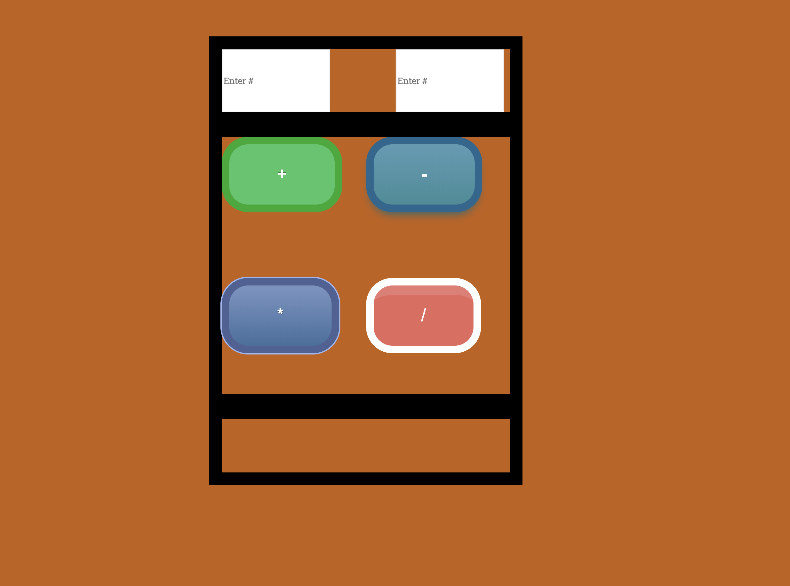

## Simple Calculator

Four Button calculator to help you do basic arithmetic.

## Link to live site:
https://zikrecalculator.netlify.com

##How It's Made:

##Tech used: HTML, CSS & JavaScript

Simple & efficient JavaScript functions that compliment a simple design to create an online calculator.

## Lessons Learned:

Was proud to write the functions in the JavaScript portion!

## Examples:

Take a look at these couple examples that I have in my own portfolio:

https://github.com/zikrehaimanot/rpsGame

https://github.com/zikrehaimanot/foodist
